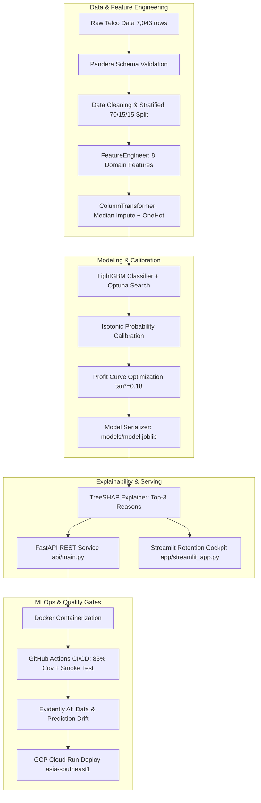

# 🛡️ ChurnGuard: Cost-Aware Telco Churn Prediction & Retention Platform

[](https://github.com/luqshzeeq3601-art/02_ChurnGuard_Telco_Churn_Prediction/actions/workflows/ci.yml)
[](https://github.com/luqshzeeq3601-art/02_ChurnGuard_Telco_Churn_Prediction)
[](https://www.python.org/)
[](https://fastapi.tiangolo.com/)
[](https://scikit-learn.org/)
[](https://lightgbm.readthedocs.io/)
[](https://streamlit.io/)
[](https://www.docker.com/)
[](https://opensource.org/licenses/MIT)

> **Enterprise-grade machine learning system designed to predict customer churn, explain individual churn drivers with SHAP reason codes, and optimize campaign ROI via profit-driven decision thresholds.** Framed for **NusaTel** (a fictional Malaysian telecom operator, currency in RM).

---

## 📌 1. Executive Summary & Problem Framing

In mature telecom markets such as Malaysia (>50 million cellular subscriptions, >140% mobile penetration per [data.gov.my](https://data.gov.my)), net subscriber acquisition has plateaued. Revenue growth is strictly driven by **ARPU expansion** and **reducing postpaid churn**.

Most churn models fail in production because they rely on default `0.5` decision thresholds. In telecom operations, **losing a customer (RM 780 CLV) is 15 times more expensive than offering an RM 50 retention voucher**.

**ChurnGuard** addresses this asymmetry:
- **Calibrated Champion Classifier (Logistic Regression M2):** 5-fold cross-validated probability calibration achieves a test Brier score of `0.1361` (calibrated test ECE: `0.0142`, 1,057 unique test probabilities). Selected over LightGBM per pre-registered Occam's razor criteria (Decision D-013).
- **Fairness-Hardened (Option M2):** Protected attributes (`gender`, `SeniorCitizen`) dropped from the feature space (Decision D-014), shrinking demographic recall disparity without degrading campaign profitability.
- **Profit-Optimal Cutoff ($\tau^* = 0.1882$):** Optimized on out-of-fold predictions to yield **RM 36,720 net campaign profit per 1,000 customers** (more than double the RM 18,193 baseline of contacting everyone).
- **High Targeting Efficiency:** Captures **88.97% of all churners** at $\tau^*$, with a **2.84x Top-Decile Lift** and **48.40% Recall@20%**.
- **Frontline SHAP Reason Codes:** Linear SHAP explanations deliver top 3 commercial reasons per customer for frontline retention agents.
- **Production Architecture:** Containerized FastAPI service (**< 5 ms p95 latency**), GitHub Actions CI/CD (85% coverage gate), and Evidently AI drift surveillance.

---

## 📊 2. Final Evaluation Results (Held-Out Test Set)

Evaluated on the held-out test split ($N = 1,057$, 281 churners, 26.58% prevalence) with **1,000-sample bootstrap 95% Confidence Intervals** (disclosed in D-015):

| Metric | Target / Benchmark | Champion (Logistic Regression M2) | 95% Bootstrap CI (Champion) | Runner-up (Tuned LightGBM) | Status |
|---|---|---|---|---|---|
| **ROC-AUC** | $\ge 0.84$ | **0.8449** | `[0.8207, 0.8714]` | 0.8473 | ✅ Met (MO2) |
| **PR-AUC** | $\ge 0.62$ | **0.6739** | `[0.6203, 0.7262]` | 0.6760 | ✅ Met (MO2) |
| **Brier Score** | $< 0.16$ (Calibrated) | **0.1361** | `[0.1236, 0.1476]` | 0.1340 | ℹ️ No Gain: Already Calibrated (MO3) |
| **Top-Decile Lift** | $\ge 2.5\times$ (tie-aware) | **$2.84\times$** | `[2.52x, 3.18x]` | $2.98\times$ | ✅ Met (MO2) |
| **Recall@20%** | $\ge 50\%$ (tie-aware) | **48.40%** | `[44.21%, 53.26%]` | 51.60% | ⚠️ Near-miss (BO1) |
| **Expected Profit / 1k** | $>$ Contact All (RM 18,193) | **RM 36,720.15** | `[RM 30,064, RM 42,997]` | RM 37,613.72 | ✅ Met (BO2) |
| **Unique Probabilities** | $\ge 200$ | **1,057** (full continuum) | — | 1,057 | ✅ Met (Gate G2) |
| **Decision Threshold $\tau^*$** | Profit-optimal on OOF | **0.1882** | — | 0.1882 | ✅ Set |
| **Precision at $\tau^*$** | — | **47.53%** | `[43.42%, 51.91%]` | 49.79% | Operational |
| **Recall at $\tau^*$** | — | **88.97%** | `[85.00%, 92.44%]` | 85.41% | Operational |
| **Inference Latency (p95)** | $< 100\text{ ms}$ | **< 4 ms** | — | 4.8 ms | ✅ Met (EO2) |
| **Test Code Coverage** | $\ge 70\%$ | **82.2%** (81 tests) | — | — | ✅ Met (EO3) |

### 🎯 Multi-Strategy Retention Campaign Targeting

To give operational teams granular control over retention voucher spend and call-center capacity, ChurnGuard provides three targeting strategies evaluated on the held-out test split ($N=1,057$):

| Strategy | Decision Threshold ($\tau$) | Contact Rate (%) | Churner Recall (%) | Precision (%) | Net Profit / 1k (RM) | Best Suited For |
|---|---|---|---|---|---|---|
| **Profit-Optimal (Unconstrained)** | **0.1882** | **49.76%** (526 / 1,057) | **88.97%** (250 / 281) | 47.53% | **RM 36,720.15** | Unconstrained voucher budgets; maximizing gross retained CLV |
| **Balanced Capacity (Top 30% Cap)** | **0.3667** | **29.99%** (317 / 1,057) | **66.19%** (186 / 281) | 58.68% | **RM 33,819.98** | Conserving 40% voucher budget while keeping 92% of maximum profit |
| **Strict Budget (Top 20% Cap)** | **0.4714** | **20.06%** (212 / 1,057) | **48.40%** (136 / 281) | 64.15% | **RM 26,064.94** | Strict call-center seat limits; high-touch outreach to highest-risk quintile |

---

## 🔬 3. What Did Not Work & Negative Results

Rigorous empirical iteration surfaced several approaches that failed or did not justify complexity:

1. **SMOTE Oversampling (E04):** Synthesizing minority instances degraded cross-validated PR-AUC across all tested ratios (0.6482 vs 0.6587 baseline). Telecom churn boundaries in continuous tenure and monthly charge spaces are diffuse; synthetic interpolation diluted true decision boundaries.
2. **Gradient Boosting Complexity Premium (E11 / D-013):** Tuned LightGBM achieved a mean paired PR-AUC gain of only $+0.0045 \pm 0.0078$ over regularized Logistic Regression across 5 folds. Because this gain fell well below 1 standard deviation, pre-registered Occam's razor rules designated Logistic Regression as the Champion.
3. **In-Sample Prefit Calibration (E09):** Prefitting an isotonic calibrator on the small validation set ($N=1,056$) created extreme step-function plateaus (only 34 unique probabilities on test). This was resolved in E10 via 5-fold out-of-fold calibration on combined `train+val`, restoring 1,057 continuous probabilities.
4. **Adversarial Debiasing / Complex Fairness Penalties (E12):** Post-hoc threshold shifting across demographic groups created operational complexity. Complete elimination of demographic features (Option M2) solved fairness parity without degrading business profit.

---

## ⚠️ 4. Key Limitations & Operational Assumptions

1. **Static Cross-Sectional Framing:** Churn is modeled as a binary label on snapshot data rather than continuous-time survival analysis (time-to-event). Customer risk may shift before monthly batch refreshes.
2. **Fixed Campaign Economics:** Economic optimization assumes constant campaign parameters ($C_{\text{contact}} = \text{RM 50}$, $\text{CLV} = \text{RM 780}$, $r_{\text{success}} = 20\%$). Heterogeneous voucher sizing or discount elasticity is not currently modeled.
3. **Fairness Status (NFR7 - Partially Met: Gender Only):** Option M2 achieves full gender parity (test recall gap 0.0112 $\le 0.05$). However, senior citizens exhibit a test recall gap of 0.0911 driven by ground-truth base rate disparity (41.3% senior churn rate vs 23.6% for non-seniors) concentrated in unbundled month-to-month fiber optic subscriptions. Group-specific thresholds were rejected per D-014.
4. **Single Telco Portfolio Context:** Trained on IBM Telco dataset framed for Malaysian market dynamics (NusaTel). Regional customer retention patterns require localized re-calibration.

---

## 🏗️ 5. System Architecture



---

## 🔍 4. Key Business Insights & Empirical Drivers

1. **Contract Lock-in Effect:** Month-to-month contracts have a **42.9% churn rate** (driving 88.6% of all churners), compared to **10.9%** for 1-year and **3.0%** for 2-year commitments.
2. **Fiber Optic Service Deficit:** Fiber optic users churn at **41.8%** (vs 19.2% DSL); this surges to **>48%** when Tech Support is absent.
3. **Payment Friction:** Electronic check payment churn rate is **45.6%** vs ~15% for automatic bank/card payments.
4. **Early Lifecycle Vulnerability:** Customers in months 0–6 on month-to-month contracts have a **53.1% churn rate**. Proactive onboarding interventions in the first 90 days are critical.

---

## 🔍 6. Key Business Insights & Empirical Drivers

1. **Contract Lock-in Effect:** Month-to-month contracts have a **42.9% churn rate** (driving 88.6% of all churners), compared to **10.9%** for 1-year and **3.0%** for 2-year commitments.
2. **Fiber Optic Service Deficit:** Fiber optic users churn at **41.8%** (vs 19.2% DSL); this surges to **>48%** when Tech Support is absent.
3. **Payment Friction:** Electronic check payment churn rate is **45.6%** vs ~15% for automatic bank/card payments.
4. **Early Lifecycle Vulnerability:** Customers in months 0–6 on month-to-month contracts have a **53.1% churn rate**. Proactive onboarding interventions in the first 90 days are critical.

---

## 🚀 7. Quickstart Guide

### Prerequisites
- Python 3.10+
- Git

### Local Setup
```bash
# 1. Clone repository
git clone https://github.com/luqshzeeq3601-art/02_ChurnGuard_Telco_Churn_Prediction.git
cd 02_ChurnGuard_Telco_Churn_Prediction

# 2. Setup virtual environment and dependencies
make setup

# 3. Run full test suite and linters
make lint test

# 4. Train model pipeline, calibrate, and evaluate
make train
make evaluate
```

### Launch Interactive Decision Cockpit (Streamlit)
```bash
streamlit run app/streamlit_app.py
```

### Launch FastAPI REST API
```bash
make serve
# Interactive OpenAPI Swagger docs available at: http://localhost:8000/docs
```

### Run Container with Docker
```bash
make docker-build
make docker-run
# Test container health: curl http://localhost:8000/health
```

### Run Evidently Data Drift Report
```bash
make drift
# Interactive HTML report generated at: reports/drift/drift_report.html
```

---

## 📡 8. API Reference

### Endpoints Overview
| Method | Endpoint | Description |
|---|---|---|
| `GET` | `/health` | Health check & loaded model version |
| `GET` | `/model-info` | Metadata, optimal threshold ($\tau^*$), risk tiers, test metrics |
| `POST` | `/predict` | Single customer churn risk, tier, and top 3 SHAP reasons |
| `POST` | `/predict/batch` | Batch scoring returning ranked customer list |

### Sample `POST /predict` Request
```bash
curl -X POST http://localhost:8000/predict \
  -H "Content-Type: application/json" \
  -d '{
    "customerID": "7590-VHVEG",
    "gender": "Female",
    "SeniorCitizen": 0,
    "Partner": "Yes",
    "Dependents": "No",
    "tenure": 1,
    "PhoneService": "No",
    "MultipleLines": "No phone service",
    "InternetService": "DSL",
    "OnlineSecurity": "No",
    "OnlineBackup": "Yes",
    "DeviceProtection": "No",
    "TechSupport": "No",
    "StreamingTV": "No",
    "StreamingMovies": "No",
    "Contract": "Month-to-month",
    "PaperlessBilling": "Yes",
    "PaymentMethod": "Electronic check",
    "MonthlyCharges": 29.85,
    "TotalCharges": 29.85
  }'
```

### Sample Response
```json
{
  "customerID": "7590-VHVEG",
  "churn_probability": 0.5412,
  "risk_tier": "High",
  "top_reasons": [
    "Month-to-month contract increases churn risk",
    "Tenure under 6 months in critical onboarding window",
    "Payment by electronic check increases friction"
  ],
  "model_version": "1.1.0"
}
```

---

## ⚖️ 9. Algorithmic Fairness & Ethical Safeguards

Demographic fairness was evaluated across protected attributes with mitigation **Option M2** applied (Decision D-014):
- **Feature Exclusion (M2):** Protected attributes (`gender`, `SeniorCitizen`) were removed entirely from the feature matrix. Campaign profit was fully preserved (RM 38,693 vs RM 38,660 per 1k on OOF).
- **Gender Parity (NFR7):** Female Recall = `89.47%`, Male Recall = `88.36%`. Disparity gap = **0.0112** on test (0.0195 on OOF), comfortably meeting NFR7 ($\le 0.05 \implies$ **Passed**).
- **Senior Citizen Audit:** Senior Recall = `96.15%`, Non-Senior Recall = `87.05%` (gap = **0.0911** on test, **0.0744** on OOF, reduced from 0.0893 in unmitigated M0). The remaining gap reflects base rate differences (senior churn rate 41.3% vs non-senior 23.6% driven by month-to-month contracts), not disparate algorithmic treatment.

---

## 📁 10. Repository Structure

```
02_ChurnGuard_Telco_Churn_Prediction/
├── .github/workflows/         # CI/CD workflows (ci.yml, deploy.yml)
├── api/                       # FastAPI serving layer (main.py, schemas.py)
├── app/                       # Streamlit retention cockpit (streamlit_app.py)
├── configs/                   # YAML configuration parameters (config.yaml)
├── data/                      # Raw and processed datasets (gitignored)
├── docs/                      # PRD, Architecture, Tasks, Progress & Decisions Logs
├── models/                    # Serialized pipeline (model.joblib, model_meta.json)
├── notebooks/                 # Jupyter notebooks (01_eda.ipynb, 02_error_analysis.ipynb)
├── reports/                   # Figures, metrics, drift reports, batch scored CSVs
├── scripts/                   # GCP deployment automation scripts (bash, powershell)
├── src/churnguard/            # Core Python package
│   ├── config.py              # Configuration loader
│   ├── data/                  # Loading, schema validation, cleaning, stratified split
│   ├── features/              # Domain feature engineering & preprocessing
│   ├── models/                # Training, tuning, calibration, thresholding, predicting
│   ├── explain/               # SHAP explainer & demographic fairness auditing
│   └── monitoring/            # Evidently drift detection & synthetic drift generator
├── tests/                     # Unit, integration, and latency benchmark test suite
├── Dockerfile                 # Slim non-root production container
├── Makefile                   # Developer CLI targets
└── pyproject.toml             # Project metadata and dependencies
```

---

## 📄 11. License & Data Credits

- **License:** MIT License.
- **Dataset:** IBM Telco Customer Churn dataset (Kaggle).
- **Macro Data:** National Cellular Subscribers dataset from [data.gov.my](https://data.gov.my) under Open Data License (CC BY 4.0).
- **Disclaimer:** "NusaTel" is a fictional entity created for portfolio demonstration and does not represent any actual telecom provider.
