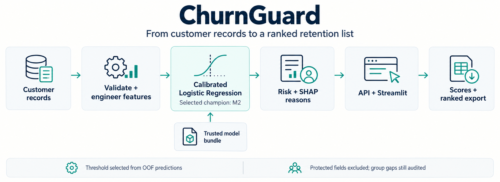

# ChurnGuard

**Score churn risk, explain the drivers and rank a retention campaign list.**

[](https://github.com/luqshzeeq3601-art/02_ChurnGuard_Telco_Churn_Prediction/actions/workflows/ci.yml)
[](LICENSE)

ChurnGuard evaluates telecom churn models on the public IBM Telco benchmark and serves the selected **M2 logistic-regression model with sigmoid OOF calibration**. A Streamlit dashboard supports form input, CSV scoring, explanations and ranked export; FastAPI provides the same scoring pipeline.

## 1. Workflow



The decision threshold comes from out-of-fold predictions. The dashboard reads saved metadata instead of hard-coding metrics. CSV download is a dashboard feature; API batch scoring returns structured customer results.

## 2. Measured results

Held-out test set: **1,057 customers**, including 281 churners.

| Measure | M2 champion |
| --- | --- |
| ROC-AUC | **0.8449** |
| PR-AUC | **0.6739** |
| Brier score | **0.1361** |
| Profit-selected threshold | **0.1882** |
| Recall at a top-20% contact budget | **48.40%**; the 50% target was missed |

Evidence and uncertainty: [saved evaluation](reports/final_metrics.json), [model card](docs/MODEL_CARD.md), [champion selection](reports/e11_champion_decision.json).

LightGBM was evaluated, but its validation gain did not justify replacing the simpler champion under the recorded selection rule. Campaign profit figures in the detailed reports use assumed contact cost, customer value and retention success; they are not observed revenue gains.

## 3. Quick start

Use Python 3.11. Clone/download the same branch or revision as this README, then run from the repository root. The verified updates are currently in [draft PR 1](https://github.com/luqshzeeq3601-art/02_ChurnGuard_Telco_Churn_Prediction/pull/1) on `fix/portfolio-remediation`.

```sh
python -m venv .venv
```

Activate with `.\.venv\Scripts\Activate.ps1` in Windows PowerShell, or `source .venv/bin/activate` on Linux/macOS.

```sh
python -m pip install -r requirements.txt
python -m pip install --no-deps -e .
```

### Open the dashboard

```sh
python -m streamlit run app/streamlit_app.py
```

Open the address printed by Streamlit. Try the form or upload [the two-row synthetic CSV](tests/fixtures/synthetic_dashboard.csv), then inspect scores/reasons and download the ranked list. [Example scored output](reports/synthetic_ui_scored.csv).

### Run the API

```sh
python -m uvicorn api.main:app --host 127.0.0.1 --port 8000
```

Open [local API docs](http://127.0.0.1:8000/docs). The committed champion can be used without retraining.

### Run the API in Docker

```sh
docker build -t churnguard:local .
docker run --rm -p 127.0.0.1:8000:8000 churnguard:local
```

## 4. API and verification

| Endpoint | Purpose |
| --- | --- |
| `GET /health` | Service health |
| `GET /model-info` | Champion metadata and threshold |
| `POST /predict` | Single-customer risk and reasons |
| `POST /predict/batch` | Ranked batch scoring |

```sh
python -m pytest tests -p no:cacheprovider --basetemp .pytest_tmp
python -m ruff check src api tests
python -m ruff format --check src api tests
```

CI runs the test/coverage gate (>=70%), builds the API image and exercises model metadata and prediction. The form, synthetic CSV and export flows have also been checked in a real browser. Retraining and experiments are documented separately in [the experiment plan](docs/06_EXPERIMENT_PLAN.md).

## 5. Limitations and delivery

- IBM data is a benchmark. The fictional Malaysian telco framing does not establish local customer performance.
- Gender and SeniorCitizen are excluded from M2's predictor matrix. This does not prove complete fairness: the recorded gender recall gap is 0.0112, while the senior/non-senior gap is 0.0911.
- The model uses a customer snapshot rather than a time-to-event churn model. SHAP reasons are associations, not causal intervention effects.
- **Required public API and Hugging Face dashboard hosting remain unverified.** Local runtime and CI success do not close those delivery tasks.

## 6. Documentation and contributions

[PRD](docs/02_PRD.md) · [Technical design](docs/04_TECHNICAL_DESIGN.md) · [Data specification](docs/05_DATA_SPEC.md) · [Tasks](docs/07_TASKS.md) · [Progress](docs/09_PROGRESS_LOG.md) · [Diagram notes and prompt](docs/assets/workflow.md)

Open an issue for a reproducible problem or a pull request with relevant checks. Preserve frozen models and selection rules; do not tune against the already examined test set.

## 7. License and data

The [MIT license](LICENSE) covers project code/documentation. IBM Telco benchmark data and supplementary Malaysian macro data have separate source terms; [the data specification](docs/05_DATA_SPEC.md) records their provenance. NusaTel is fictional.
