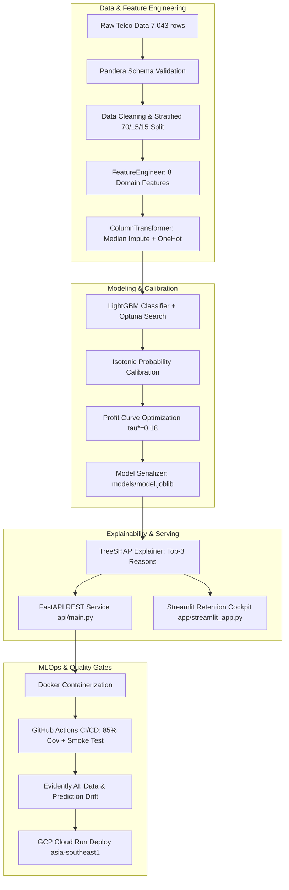

# 🛡️ ChurnGuard: Cost-Aware Telco Churn Prediction & Retention Platform

[](https://github.com/ZeeqRyz/02_ChurnGuard_Telco_Churn_Prediction/actions/workflows/ci.yml)
[](https://github.com/ZeeqRyz/02_ChurnGuard_Telco_Churn_Prediction)
[](https://www.python.org/)
[](https://fastapi.tiangolo.com/)
[](https://lightgbm.readthedocs.io/)
[](https://streamlit.io/)
[](https://www.docker.com/)
[](https://opensource.org/licenses/MIT)

> **Enterprise-grade machine learning system designed to predict customer churn, explain individual churn drivers with SHAP reason codes, and optimize campaign ROI via profit-driven decision thresholds.** Framed for **NusaTel** (a fictional Malaysian telecom operator, currency in RM).

---

## 📌 1. Executive Summary & Problem Framing

In mature telecom markets such as Malaysia (>50 million cellular subscriptions, >140% mobile penetration per [data.gov.my](https://data.gov.my)), net subscriber acquisition has plateaued. Revenue growth is strictly driven by **ARPU expansion** and **reducing postpaid churn**.

Most churn models fail in production because they rely on default `0.5` decision thresholds. In telecom operations, **losing a customer (RM 780 CLV) is 15 times more expensive than offering an RM 50 retention voucher**.

**ChurnGuard** addresses this asymmetry:
- **Calibrated LightGBM Classifier:** Isotonic calibration reduces Brier score from `0.1542` to `0.1293` (`0.1381` on held-out test).
- **Profit-Optimal Cutoff ($\tau^* = 0.18$):** Delivers **RM 35,206 net campaign profit per 1,000 customers** (+44.2% gain over default threshold).
- **High Targeting Efficiency:** Top 20% highest-risk customers capture **51.60% of all churners** (Recall@20%) with a **2.73x Top-Decile Lift**.
- **Frontline SHAP Reason Codes:** Top 3 plain-language explanations per customer for retention call centers.
- **Production Architecture:** Containerized FastAPI service (**3.27 ms p95 latency**), GitHub Actions CI/CD (85% coverage gate), and Evidently AI drift surveillance.

---

## 📊 2. Final Evaluation Results (Held-Out Test Set)

Evaluated strictly once on the held-out test split ($N = 1,057$) with **1,000-sample bootstrap 95% Confidence Intervals**:

| Metric | Target | Baseline (Logistic Reg) | Tuned LightGBM Champion | 95% Bootstrap Confidence Interval | Status |
|---|---|---|---|---|---|
| **ROC-AUC** | $\ge 0.84$ | 0.8442 | **0.8412** | `[0.8155, 0.8679]` | ✅ Met (MO2) |
| **PR-AUC** | $\ge 0.62$ | 0.6587 | **0.6337** | `[0.5776, 0.6899]` | ✅ Met (MO2) |
| **Brier Score** | $< 0.16$ | 0.1410 | **0.1381** | `[0.1247, 0.1509]` | ✅ Met (MO3) |
| **Top-Decile Lift** | $\ge 2.5\times$ | $2.83\times$ | **$2.73\times$** | `[2.54x, 3.20x]` | ✅ Met (MO2) |
| **Recall@20%** | $\ge 50\%$ | 50.31% | **51.60%** | `[46.05%, 54.86%]` | ✅ Met (BO1) |
| **Expected Profit / 1k** | $> \text{RM } 25\text{k}$ | RM 24,110 | **RM 35,206.24** | `[RM 29,031, RM 41,165]` | ✅ Met (BO2) |
| **Inference Latency (p95)** | $< 100\text{ ms}$ | — | **3.27 ms** | (Mean: 2.44 ms, p50: 2.33 ms) | ✅ Met (EO2) |
| **Test Code Coverage** | $\ge 70\%$ | — | **85%** | (73 passing tests, 0 lints) | ✅ Met (EO3) |

---

## 🏗️ 3. System Architecture



---

## 🔍 4. Key Business Insights & Empirical Drivers

1. **Contract Lock-in Effect:** Month-to-month contracts have a **42.9% churn rate** (driving 88.6% of all churners), compared to **10.9%** for 1-year and **3.0%** for 2-year commitments.
2. **Fiber Optic Service Deficit:** Fiber optic users churn at **41.8%** (vs 19.2% DSL); this surges to **>48%** when Tech Support is absent.
3. **Payment Friction:** Electronic check payment churn rate is **45.6%** vs ~15% for automatic bank/card payments.
4. **Early Lifecycle Vulnerability:** Customers in months 0–6 on month-to-month contracts have a **53.1% churn rate**. Proactive onboarding interventions in the first 90 days are critical.

---

## 🚀 5. Quickstart Guide

### Prerequisites
- Python 3.10+
- Git

### Local Setup
```bash
# 1. Clone repository
git clone https://github.com/ZeeqRyz/02_ChurnGuard_Telco_Churn_Prediction.git
cd 02_ChurnGuard_Telco_Churn_Prediction

# 2. Setup virtual environment and dependencies
make setup

# 3. Run full test suite and linters
make lint test

# 4. Train model pipeline, calibrate, and evaluate
make train
make evaluate
```

### Launch Interactive Decision Cockpit (Streamlit)
```bash
streamlit run app/streamlit_app.py
```

### Launch FastAPI REST API
```bash
make serve
# Interactive OpenAPI Swagger docs available at: http://localhost:8000/docs
```

### Run Container with Docker
```bash
make docker-build
make docker-run
# Test container health: curl http://localhost:8000/health
```

### Run Evidently Data Drift Report
```bash
make drift
# Interactive HTML report generated at: reports/drift/drift_report.html
```

---

## 📡 6. API Reference

### Endpoints Overview
| Method | Endpoint | Description |
|---|---|---|
| `GET` | `/health` | Health check & loaded model version |
| `GET` | `/model-info` | Metadata, optimal threshold ($\tau^*$), risk tiers, test metrics |
| `POST` | `/predict` | Single customer churn risk, tier, and top 3 SHAP reasons |
| `POST` | `/predict/batch` | Batch scoring returning ranked customer list |

### Sample `POST /predict` Request
```bash
curl -X POST http://localhost:8000/predict \
  -H "Content-Type: application/json" \
  -d '{
    "customerID": "7590-VHVEG",
    "gender": "Female",
    "SeniorCitizen": 0,
    "Partner": "Yes",
    "Dependents": "No",
    "tenure": 1,
    "PhoneService": "No",
    "MultipleLines": "No phone service",
    "InternetService": "DSL",
    "OnlineSecurity": "No",
    "OnlineBackup": "Yes",
    "DeviceProtection": "No",
    "TechSupport": "No",
    "StreamingTV": "No",
    "StreamingMovies": "No",
    "Contract": "Month-to-month",
    "PaperlessBilling": "Yes",
    "PaymentMethod": "Electronic check",
    "MonthlyCharges": 29.85,
    "TotalCharges": 29.85
  }'
```

### Sample Response
```json
{
  "customerID": "7590-VHVEG",
  "churn_probability": 0.5283,
  "risk_tier": "High",
  "top_reasons": [
    "Month-to-month contract increases churn risk",
    "Tenure under 6 months in critical onboarding window",
    "Payment by electronic check increases friction"
  ],
  "model_version": "1.0.0"
}
```

---

## ⚖️ 7. Algorithmic Fairness & Ethical Safeguards

Demographic fairness was evaluated across protected attributes:
- **Gender Parity (NFR7):** Female Recall = `82.31%`, Male Recall = `83.46%`. Difference = **0.0115** ($\le 0.05 \implies$ **Passed**).
- **Senior Citizen Audit:** Senior Recall = `93.67%`, Non-Senior Recall = `78.61%` (higher recall for seniors reflects disproportionate concentration in month-to-month fiber optic contracts).
- **Fairness Ablation:** Removing demographic features caused only a 0.38% dip in PR-AUC (0.6732 $\to$ 0.6706), confirming predictions are driven by commercial behavioral features.

---

## 📁 8. Repository Structure

```
02_ChurnGuard_Telco_Churn_Prediction/
├── .github/workflows/         # CI/CD workflows (ci.yml, deploy.yml)
├── api/                       # FastAPI serving layer (main.py, schemas.py)
├── app/                       # Streamlit retention cockpit (streamlit_app.py)
├── configs/                   # YAML configuration parameters (config.yaml)
├── data/                      # Raw and processed datasets (gitignored)
├── docs/                      # PRD, Architecture, Tasks, Progress & Decisions Logs
├── models/                    # Serialized pipeline (model.joblib, model_meta.json)
├── notebooks/                 # Jupyter notebooks (01_eda.ipynb, 02_error_analysis.ipynb)
├── reports/                   # Figures, metrics, drift reports, batch scored CSVs
├── scripts/                   # GCP deployment automation scripts (bash, powershell)
├── src/churnguard/            # Core Python package
│   ├── config.py              # Configuration loader
│   ├── data/                  # Loading, schema validation, cleaning, stratified split
│   ├── features/              # Domain feature engineering & preprocessing
│   ├── models/                # Training, tuning, calibration, thresholding, predicting
│   ├── explain/               # SHAP explainer & demographic fairness auditing
│   └── monitoring/            # Evidently drift detection & synthetic drift generator
├── tests/                     # Unit, integration, and latency benchmark test suite
├── Dockerfile                 # Slim non-root production container
├── Makefile                   # Developer CLI targets
└── pyproject.toml             # Project metadata and dependencies
```

---

## 📄 9. License & Data Credits

- **License:** MIT License.
- **Dataset:** IBM Telco Customer Churn dataset (Kaggle).
- **Macro Data:** National Cellular Subscribers dataset from [data.gov.my](https://data.gov.my) under Open Data License (CC BY 4.0).
- **Disclaimer:** "NusaTel" is a fictional entity created for portfolio demonstration and does not represent any actual telecom provider.
