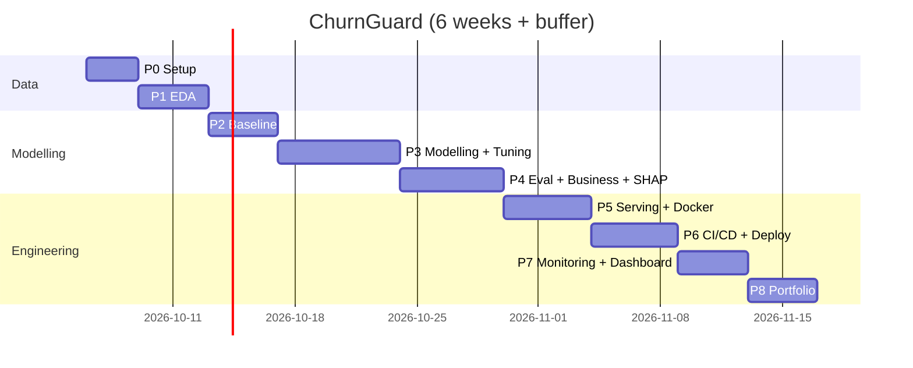

# 03. Project Plan

## 1. Approach
- Methodology: **CRISP-DM** for the ML lifecycle, run in **1-week sprints**
- Capacity: about 10 to 12 hours per week (final-year student)
- Duration: **6 weeks** (+1 buffer week)
- Rule: finish a phase's exit criteria before moving on

## 2. Phases and Milestones
| Phase | Name | Week | Key outputs | Exit criteria (milestone) |
|---|---|---|---|---|
| 0 | Setup | W1 | Repo, env, Makefile, folder structure, data downloaded | `make setup` works, data in `data/raw` |
| 1 | Data understanding + EDA | W1 | Validation module, EDA notebook, insights | Schema checks pass; 5+ written insights |
| 2 | Baseline | W2 | Feature pipeline, Dummy + Logistic Regression, MLflow | Baseline metrics logged in MLflow |
| 3 | Modelling + tuning | W2-W3 | RF, XGBoost, LightGBM, Optuna, calibration | Best model meets MO1, MO2, MO4 |
| 4 | Evaluation, business and explainability | W3-W4 | Profit curve, threshold, SHAP, fairness, final test | MO3, BO1-BO3 met; test set used once |
| 5 | Serving | W4 | FastAPI, batch CLI, Docker, tests | EO2, EO3 local; `docker run` works |
| 6 | CI/CD + Deploy | W5 | GitHub Actions, Cloud Run | EO4; CI green |
| 7 | Monitoring + Dashboard | W5-W6 | Evidently drift, Streamlit (optional) | EO5 met |
| 8 | Portfolio packaging + publishing | W6 | README, demo GIF, HF Spaces demo, Kaggle notebook, LinkedIn post | All targets in `10_PUBLISHING_PLAN.md` live |
| - | Buffer | W7 | Fix slippage | - |

## 3. Timeline (Gantt)

## 4. Work Breakdown
Detailed tasks with IDs and acceptance criteria: `07_TASKS.md`.

## 5. Roles (solo, but act in each hat)
| Hat | Responsibility |
|---|---|
| Project Manager | Scope, timeline, progress log, risk review each week |
| Data Scientist | EDA, features, modelling, evaluation |
| ML Engineer | Pipelines, API, Docker, CI/CD, monitoring |
| Reviewer | Self code review against `CLAUDE.md` rules before ticking tasks |

## 6. Risk Register
| ID | Risk | Likelihood | Impact | Mitigation |
|---|---|---|---|---|
| R1 | Data leakage inflates metrics | Medium | High | Pipelines only; split first; test set used once |
| R2 | Small dataset (7k rows) gives noisy metrics | High | Medium | Stratified 5-fold CV; report mean plus or minus std; bootstrap CI on test |
| R3 | Class imbalance (about 26% churn) | High | Medium | PR-AUC focus, class weights, threshold tuning; compare SMOTE only inside CV |
| R4 | Scope creep (deep learning, uplift) | Medium | Medium | PRD Future Work list; PM gate |
| R5 | Cloud free-tier or billing issue | Low | Medium | Fallback: Render / Hugging Face Spaces; Docker proof locally |
| R6 | Time conflict with FYP / exams | High | High | Buffer week; phases 7-8 can shrink; weekly re-plan |
| R7 | `TotalCharges` blanks parse as strings | High | Low | Handled in validation (see Data Spec) |

## 7. Communication and Tracking
- Daily / per session: update `09_PROGRESS_LOG.md`
- Weekly (Sunday): PM review: progress vs plan, risks, re-plan; write summary in progress log
- Decisions: `08_DECISIONS_LOG.md`
- Git: conventional commits (`feat:`, `fix:`, `docs:`, `test:`, `chore:`), one branch per phase, merge via PR

## 8. Definition of Done (per task)
- Meets acceptance criteria in `07_TASKS.md`
- Code in `src/`, typed, documented, ruff clean
- Tests added / passing
- MLflow run logged (if modelling)
- Task ticked + progress log updated
