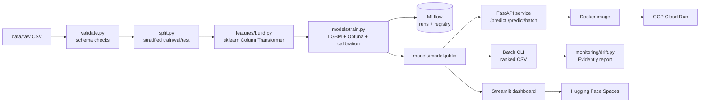

# 04. Technical Design

## 1. Architecture


## 2. Tech Stack (summary; full list in `00_TECH_STACK.md`)
| Layer | Tool | Reason |
|---|---|---|
| Language | Python 3.11 | Industry standard |
| Data | pandas, numpy, pandera | Manipulation + schema validation |
| ML | scikit-learn, LightGBM, XGBoost, imbalanced-learn | Job-posting stack |
| Tuning | Optuna | Efficient Bayesian search |
| Explainability | SHAP | Per-customer reasons |
| Tracking | MLflow (local file store) | Required by BSI, DKSH postings |
| Serving | FastAPI, Pydantic, Uvicorn | Fast, typed API |
| Dashboard | Streamlit on Hugging Face Spaces | Public demo |
| Monitoring | Evidently | Drift reports |
| Quality | pytest, pytest-cov, ruff, pre-commit | CI gates |
| Packaging | Docker | Portability |
| CI/CD | GitHub Actions | Free, standard |
| Cloud | GCP Cloud Run | Free tier, serverless containers |
| Config | YAML (`configs/config.yaml`) | No hardcoded paths / params |

## 3. Repository Structure
```
02_ChurnGuard_Telco_Churn_Prediction/
├── CLAUDE.md
├── README.md
├── Makefile
├── pyproject.toml
├── requirements.txt
├── Dockerfile
├── .gitignore
├── .github/workflows/ci.yml
├── configs/config.yaml
├── data/                 # gitignored
│   ├── raw/
│   ├── interim/
│   └── processed/
├── docs/                 # all planning docs
├── notebooks/
│   ├── 01_eda.ipynb
│   └── 02_error_analysis.ipynb
├── src/churnguard/
│   ├── __init__.py
│   ├── config.py
│   ├── data/{load.py, validate.py, split.py}
│   ├── features/build.py
│   ├── models/{train.py, tune.py, evaluate.py, predict.py, threshold.py}
│   ├── explain/shap_explain.py
│   └── monitoring/drift.py
├── api/{main.py, schemas.py}
├── app/streamlit_app.py
├── models/               # gitignored artifacts
├── reports/{figures/, drift/}
└── tests/{test_validate.py, test_features.py, test_predict.py, test_api.py}
```

## 4. Data Flow and Split
- Split once, stratified on `Churn`, seed 42: **train 70% / val 15% / test 15%**
- CV (5-fold stratified) on train for model selection and tuning
- Val: calibration + threshold selection
- Test: final, single evaluation; results frozen in `reports/final_metrics.json`

## 5. Feature Pipeline (sklearn)
```
ColumnTransformer
├── numeric:  tenure, MonthlyCharges, TotalCharges, engineered numerics
│             -> SimpleImputer(median) -> StandardScaler (linear models only)
├── binary:   Yes/No columns -> OrdinalEncoder
└── nominal:  Contract, PaymentMethod, InternetService, ...
              -> OneHotEncoder(handle_unknown="ignore")
```
Engineered features (defined in `05_DATA_SPEC.md` section 5) are built by a custom `FeatureEngineer` transformer placed **before** the ColumnTransformer, so serving uses identical logic.

## 6. Model Artifact
- Saved as one `joblib` file: full `Pipeline(FeatureEngineer -> ColumnTransformer -> CalibratedClassifierCV(LGBM))`
- Sidecar `model_meta.json`: version, threshold, training date, metrics, feature list, git commit hash

## 7. API Design
| Method | Path | Description |
|---|---|---|
| GET | `/health` | `{"status": "ok"}` |
| GET | `/model-info` | Version, threshold, metrics, trained_at |
| POST | `/predict` | Single customer (schema in PRD section 6) |
| POST | `/predict/batch` | List of customers, returns ranked list |

- Pydantic models enforce types and allowed category values
- Model loaded once at startup
- SHAP `TreeExplainer` created once at startup; reasons mapped to plain-language templates

## 8. Makefile Targets
| Target | Action |
|---|---|
| `setup` | create venv, install deps, pre-commit install |
| `data` | download / validate raw data |
| `train` | full training pipeline + MLflow log |
| `evaluate` | final test evaluation + reports |
| `score FILE=...` | batch scoring to `reports/scored.csv` |
| `serve` | run FastAPI locally |
| `lint` / `test` | ruff / pytest with coverage |
| `docker-build` / `docker-run` | container lifecycle |
| `drift` | Evidently report |
| `mlflow-ui` | open MLflow UI |

## 9. CI/CD (GitHub Actions)
1. On push / PR: install, `ruff`, `pytest --cov` (fail under 70%)
2. On push to `main`: build Docker image, smoke test `/health`
3. On tag `v*`: push image to Artifact Registry, deploy to Cloud Run

## 10. Monitoring Design
- Reference data: training set
- Current data: simulated batch (test set with injected shifts, e.g. +20% MonthlyCharges, more month-to-month contracts)
- Report: data drift per feature + prediction drift; saved to `reports/drift/`
- Retrain trigger rule (documented, not automated): drift share over 30% of features or PR-AUC drop over 0.05
