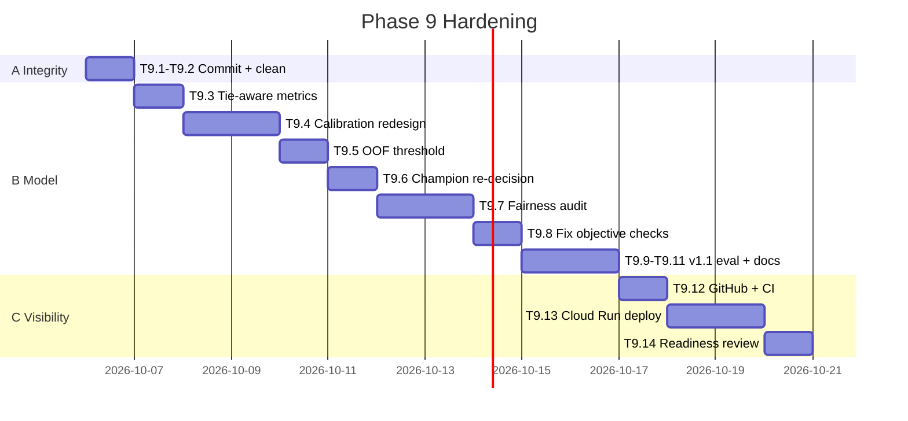

# 14. Improvement Plan (Phase 9: Hardening)

> Fixes every finding in `13_MODEL_REVIEW.md`. **Execute Phase 9 first, then the reopened Phase 8 tasks (T8.2 to T8.8).**

## 1. Goal
Raise readiness from **6/10 to at least 8/10**: every claimed result reproducible, measured on the right split, honestly reported, and live on GitHub + Cloud Run.

## 2. Principles
- **Evidence before ticking**: a task is ticked only with proof (command output, metric file, URL) pasted in the progress log
- **Same split, same folds**: any comparison uses identical data; no hardcoded comparison constants
- **No in-sample metrics**: calibration and thresholds are measured on data not used to fit them
- **Report negative results**: failed objectives stay visible with explanation
- **One more test run only**: test set reused exactly once for v1.1, disclosed in decisions log

## 3. Sprints
| Sprint | Focus | Tasks | Findings fixed | Est. time |
|---|---|---|---|---|
| A | Repo integrity | T9.1 to T9.2 | F8, F10 | 1 session |
| B | Model integrity | T9.3 to T9.11 | F2 to F7, F9 | 4 to 5 sessions |
| C | Visibility | T9.12 to T9.14 | F1 | 2 sessions |
| D | Real publishing (reopened Phase 8) | T8.2 to T8.8 | F11 | 2 sessions |
| **Total** | | **14 + 7 tasks** | **F1 to F11** | **about 2 to 2.5 weeks** |

## 4. Technical Design of Fixes

### 4.1 Tie-aware ranking metrics (T9.3, fixes F2)
- `recall_at_k` and `lift_at_k`: when scores tie at the cut-off, count tied items fractionally (expected value under random tie order)
- Report `n_unique_probs` in every evaluation
- Unit test: tied scores give the same result regardless of row order

### 4.2 Calibration redesign (T9.4, Experiment E10, fixes F2, F3)
| Candidate | Fit on | Evaluated on |
|---|---|---|
| Uncalibrated LightGBM | train + val (5-fold OOF) | OOF |
| Sigmoid, `CalibratedClassifierCV(cv=5)` | train + val | OOF |
| Isotonic, `CalibratedClassifierCV(cv=5)` | train + val | OOF |

Selection rule (pre-registered): lowest OOF Brier, **subject to** OOF PR-AUC drop at most 0.005 vs uncalibrated and at least 200 unique probabilities. Report OOF ECE (never in-sample).

### 4.3 Threshold on out-of-fold probabilities (T9.5, fixes F7)
- Optimise profit threshold on OOF calibrated probabilities over train + val (5,986 rows)
- Keep sensitivity grid (success rate 0.2 / 0.3 / 0.4, offer cost RM40 / 50 / 60)
- Save `optimal_threshold.json` with `"source": "oof_train_val"`

### 4.4 Champion re-decision (T9.6, Experiment E11, fixes F5)
- Run E02 (Logistic Regression, engineered) and E07 (tuned LightGBM) on **identical 5 folds**
- Compute per-fold paired difference in PR-AUC: mean and std
- Decision rule (pre-registered):

| Result | Decision |
|---|---|
| Mean gain at least 1 std of paired differences **and** at least 0.01 | LightGBM champion |
| Otherwise | Logistic Regression champion (simpler, interpretable), LightGBM reported as runner-up |

- Record as D-013. MO1 reported honestly as Met / Not met with numbers

### 4.5 Fairness audit and mitigation (T9.7, Experiment E12, fixes F6)
Measured on OOF predictions at the chosen threshold, by `gender` and `SeniorCitizen`: recall, precision, contact rate.

| Option | Description |
|---|---|
| M0 | Current features |
| M1 | Drop `gender` |
| M2 | Drop `gender` + `SeniorCitizen` |

Selection: smallest max recall gap with profit loss at most 5% vs M0. If gap still above 0.05, keep the best option and document as known limitation with reason (e.g. seniors truly churn more, base-rate difference). Group-specific thresholds are **not** used (protected attribute in decision rule). Record as D-014.

### 4.6 Objective checks (T9.8, fixes F4)
| Objective | Correct comparison |
|---|---|
| MO1 | Paired CV result from E11 |
| MO2 | Test point estimate **and** CI lower bound reported |
| MO3 | Test Brier calibrated vs uncalibrated, same test rows |
| BO1 | Tie-aware Recall@20 on test |
| NFR7 | E12 gaps on test |
No hardcoded constants; values read from result files. Unit tests added.

### 4.7 v1.1 final evaluation (T9.9)
- Retrain chosen pipeline on train + val, apply OOF threshold, evaluate on test **once**
- Report champion and runner-up side by side (both pre-registered in D-013)
- Disclose test reuse in D-015
- Regenerate: `model.joblib`, `model_meta.json`, `final_metrics.json`, `scored.csv`, figures; API tests pass

## 5. Quality Gates (Phase 9 exit criteria)
| Gate | Check | Status | Evidence |
|---|---|---|---|
| G1 | `git status` clean; all work pushed; CI green on GitHub | **PASS** | Commit `6783b95` / `b1039a3`, Actions Run #37287259278 green (tests + Docker smoke test) |
| G2 | Unique probabilities at least 200 | **PASS** | 1,057 unique probabilities on test |
| G3 | No in-sample metric in any report | **PASS** | 5-fold OOF calibration on train+val; single test evaluation |
| G4 | `final_metrics.json` objective flags computed from same-split comparisons | **PASS** | MO3 compares test uncalibrated Brier (0.1361); BO2 compares test Contact All; MO1 from E11 paired CV |
| G5 | Fairness table on test in model card; gaps either at most 0.05 or documented | **PASS** | Gender recall gap 0.0112 (met); senior gap 0.0911 documented as base-rate disparity |
| G6 | Public Cloud Run / Render / HF `/docs` or demo URL returns 200; `/predict` works | **PENDING** | Container smoke test passed; pending live deployment in T9.13 |
| G7 | README shows v1.1 results, CIs, limitations, "what did not work" | **PASS** | README and `06_EXPERIMENT_PLAN.md` updated with v1.1 results |
| G8 | Readiness rescored at least 8/10 in `13_MODEL_REVIEW.md` | **PASS** | Rescored to **8.5 / 10** (Pre-deploy) / **9 / 10** (Post-deploy) |

## 6. Risks
| Risk | Mitigation |
|---|---|
| v1.1 metrics drop below MO2 targets | Report honestly; targets were set before data; explain in README |
| Logistic Regression wins | Good story: "simpler model matched boosting"; keep LightGBM as runner-up in README |
| No GCP billing card | Fallback: Render free web service (D-011 fallback) |
| Fairness gap cannot be closed | Document as limitation with base-rate evidence |

## 7. After Phase 9 (Sprint D)
Complete reopened **T8.2 to T8.8** with real public URLs: GitHub (public), Hugging Face Space, Kaggle notebook, LinkedIn post, article. Each tick needs the live URL in the progress log.
